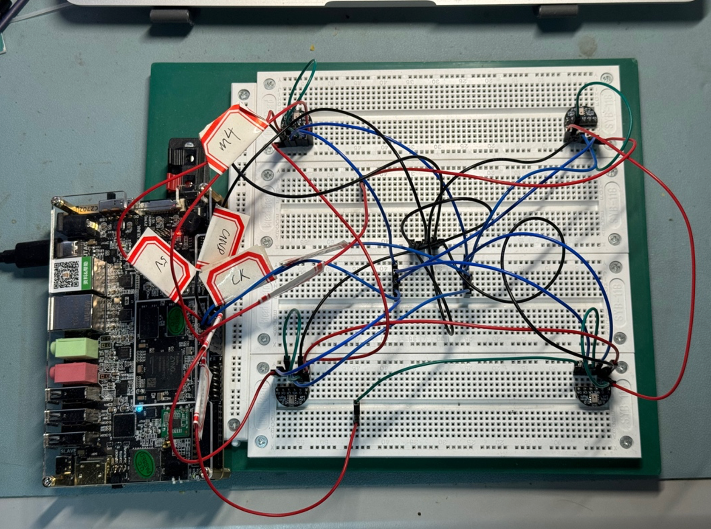
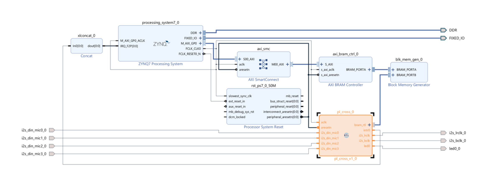

# eko

## Table of contents

- [Intro](#intro)
- [Top-level Diagram](#top-level-diagram)
- [Sampling](#sampling)
- [Preprocessing](#preprocessing)
- [Voice Activity Detection](#voice-activity-detection)
- [Improved PHAT](#improved-phat)
- [DSP chain](#dsp-chain)
- [Communication between PL and PS](#communication-between-pl-and-ps)
- [Angle Estimation](#angle-estimation)
- [Result](#result)
- [Q&A](#qa)
- [Credits](#credits)

## Project

### Intro

The system implements sound source localization using two pairs of digital MEMS microphones and a Zynq FPGA.

The purpose of this system is to measure the direction of a sound source (direction of arrival, DoA) in real time, with the results presented as the deviation angle relative to the center of the microphone array.

The entire system consists primarily of three components:

- 4 digital MEMS microphones (MSM26S4030H0) running at 16bit/48KHz

- FPGA development board (based on XC7Z020-1CLG400)

- Host computer (any device supporting serial communication at 115200 baud rate)

The angle is determined by analyzing the time difference of arrival (TDOA) of acoustic signals between consecutive microphone pairs. Using this data, the sound's position relative to the device's center can be computed.

### Top-level Diagram

#### Hardware

#### Software

### Sampling

The sampling of this system is based on the I2S interface, with a sampling precision of 16 bits and a sampling frequency of 48.8 kHz, and a frame of consisting of 1024 16 bits audio data. The timing can be referenced from Philips' official documentation. The system's four microphones are uniformly collected on the left frame of the I2S to ensure consistency in collection.

### Preprocessing

The preprocessing section includes two parts (in order):

- **FIR low-pass filter**, according to the Nyquist sampling theorem, the sound range sampled by this system is from 0 to 24.4 kHz, while our target frequency range is approximately 300 to 8000 Hz, so a low-pass filter is needed. (The specific coefficients are generated in Matlab).

- **CIC upsampling filter**, providing four times upsampling, which raises the theoretical equivalent sampling frequency to 195.2 kHz(The number of data per frame has also changed from 1024 to 4096). The purpose of upsampling is to improve the accuracy of the TDOA sound source localization system.

### Voice Activity Detection

To prevent the system from detecting sound direction when there is no valid sound input(aka noise), we need a module to detect whether the input sound is a valid voice activity. The voice activity detection in this system is based on **short-term energy detection with dynamic thresholds.** In short, the energy of sound is proportional to the square of its volume, and we can set a threshold as the criterion for voice activity.

The specific implementation is simple, and here is a brief overview: We can create a window function that slides over the entire frame to detect whether there is voice activity within the frame:

- If multiple window functions detect voice activity, it is judged as having sound and is sent to the backend for detection.

- If only a few or no window functions detect voice activity, it is considered noise, and the threshold is updated according to a certain weight.

### Improved PHAT

The specifics of GCC-PHAT **will not be covered** here. In this system design, the conventional GCC-PHAT has been **improved**. Below, we will briefly introduce the reasons and principles behind the improvement.

#### Why

**PHAT weighting, although a popular choice, has many issues**, the most obvious being its accuracy in low signal-to-noise ratio environments. A classic example is the peak appearing at zero delay in the final time-domain result, meaning there is no time difference between the two audio signals. For more details, please refer to the link below:

- https://dsp.stackexchange.com/questions/69905/gcc-phat-always-peaks-at-zero-when-estimating-delay-offset
- https://dsp.stackexchange.com/questions/55470/gcc-phat-generalized-cross-correlation-always-peak-at-delay-0-on-real-audio-si
- https://bioacoustics.stackexchange.com/questions/1099/difference-between-gcc-flavours

A reasonable explanation is that the weighting method of PHAT involves dividing a complex number (FFT frequency domain result) by its own modulus (i.e., normalization). During this process, some "numerically small" complex numbers are **significantly amplified due to the small divisor (modulus)**, and there are many such "numerically small" components in the frequency domain results of real signals. PHAT weights elevate the weights of many of these "numerically small" components, thereby affecting the algorithm's own judgment.

#### How

How can we address this issue? We can observe that the PHAT weights primarily affect extreme values (very small or very large values). We can simply modify the weights, which means adding a constant to the modulus when weighting the frequency domain results, to prevent "numerically small" complex numbers from being excessively amplified due to a small divisor, that is:

$$
\frac{1}{|\textbf{R}_{x_1,x_2}|}\Rightarrow\frac{1}{|\textbf{R}_{x_1,x_2}|+C}
$$

The practice of this system involves taking the average of the modulus of the audio sampling frame frequency domain results, multiplied by 0.1. If your hardware differs from this system, please experiment accordingly.

### DSP chain

The entire DSP chain(_responsible for TDOA_) runs on the **programmable logic** of the Zynq, and is entirely based on the standard [AMBA AXI4-Stream](https://documentation-service.arm.com/static/642583d7314e245d086bc8c9?token=). The connection diagram is shown above, with the numbers on the arrows representing the precision of the input data(how many bits). A brief description of the IP core configuration is as follows：

- FFT：Radix-2 Burst I/O, scale enable([00 00 00 00 00 00 01 01 01 01 01 01])
- Complex Multiplier(the \*): Random rounding
- CORDIC POLAR: Translate mode(only take magnitude part)
- Divider: Output with Fractional Part
- IFFT: Radix-2 Burst I/O, scale enable([00 01 01 01 01 01 01 01 01 01 01 01])

### Communication between PL and PS

The communication between PL and PS is based on the AXI GP (General Purpose) bus, with the main modules located on the PL side. The transmission content includes：

- The time-domain result of IFFT, we only take a portion of 208(first 104 and last 104), this is because we only take the delay numbers in the interval we are interested in, the specific calculation method is as follows, $d_\max$ represents the normal distance between the two microphones
  $$
  N_\max=2\times\frac{d_\max\times f}{c}=2\times\frac{18\mathrm{cm}\times 192.5\mathrm{kHz}}{342\mathrm{m/s}}\approx208
  $$
- Override VAD threshold: For manually override VAD threshold in certain circumstances

### Angle Estimation

Angle estimation involves relatively complex matrix operations, but since this system employs a simple regular quadrilateral array, the implementation is straightforward. Below is a brief introduction to the logic:

- It is known that the position of the delay peak in the IFFT time-domain result is proportional to the TDOA delay value.

- For a regular quadrilateral array, the azimuth angle of the sound source can be represented by $\arctan(\frac{\tau_1}{\tau_2})$.

- Therefore, we can directly replace the time delay values in the formula with the positions of the delay peaks.

The specific calculation uses the atan2 function (for details, refer to [Matlab's documentation](https://www.mathworks.com/help/matlab/ref/atan2.html)), and we can directly use the implementation from math.h here.

### Result

#### Block Design

#### Resourse Uasge

|            |  LUT   | LUTRAM | Register |  BRAM  |  DSP   |
| :--------: | :----: | :----: | :------: | :----: | :----: |
|   Total    | 53200  | 17400  |  106400  |  140   |  220   |
|    Used    | 18469  |  1416  |  29130   |  58.5  |   37   |
| Percentage | 34.72% | 8.14%  |  27.38%  | 41.79% | 16.82% |

#### Power

#### Timing

#### Processing Speed

The time to process one frame is approximately 1239us(microseconds), and it takes about 20.9ms(milliseconds) to collect 1024 data points at a sampling rate of 48.8 kHz, so it does not cause a processing bottleneck.

#### Accuracy

The overall test environment was conducted outdoors in an open space to minimize interference from indoor reverberation on the system. The distances between the sound source and the microphone were 1.5 meters, with the sound source placed at azimuth angles of 330°, 180°, 45°, and 120°. The sound source was a recording of a human cough. Each test scenario was repeated 15 times, and the final results were averaged.

| Actual Azimuth/° |  330   |  180   |  45   |  120   |
| :--------------: | :----: | :----: | :---: | :----: |
|   Avg Result/°   | 328.73 | 176.26 | 47.63 | 117.36 |
|     STDDEV/°     |  1.99  |  3.46  | 3.07  |  1.85  |

### Q&A

#### Can I implement this design in a pure RTL(without PS)?

Yes, the design of this system is portable to pure FPGA. From the backend perspective, the angle estimation should be replaced with CORDIC's arctan (remember to enable Coarse Angle Rotation). However, the resource capacity of FPGA level like XC7A35T might be not enough, it is recommended to use XC7A100T.

#### Software tool used?

- Vivado 2023.2
- Vitis Classic 2023.2
- Matlab 2023b
- numpy

### Credits

- https://web.mit.edu/6.111/volume2/www/f2018/projects/frwang_Project_Design_Presentation.pdf
- https://docs.amd.com/v/u/en-US/pg105-cordic
- …
